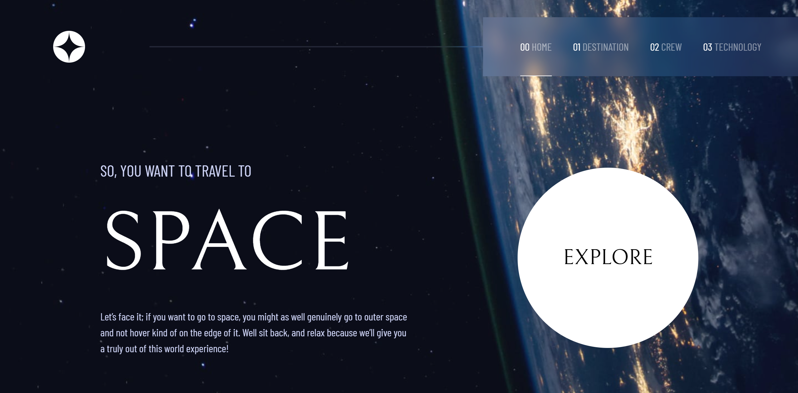
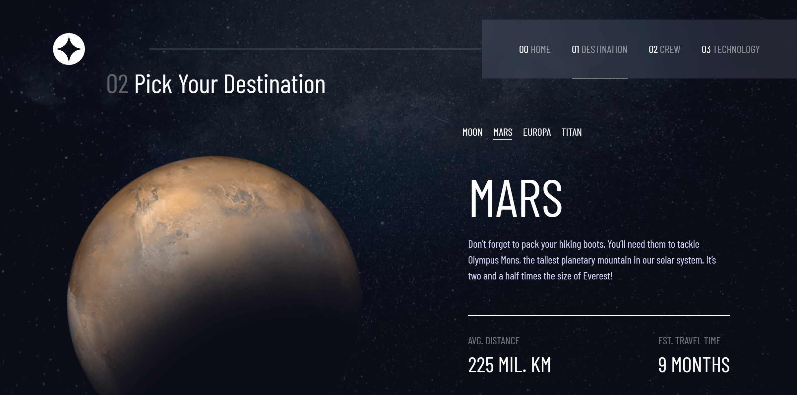
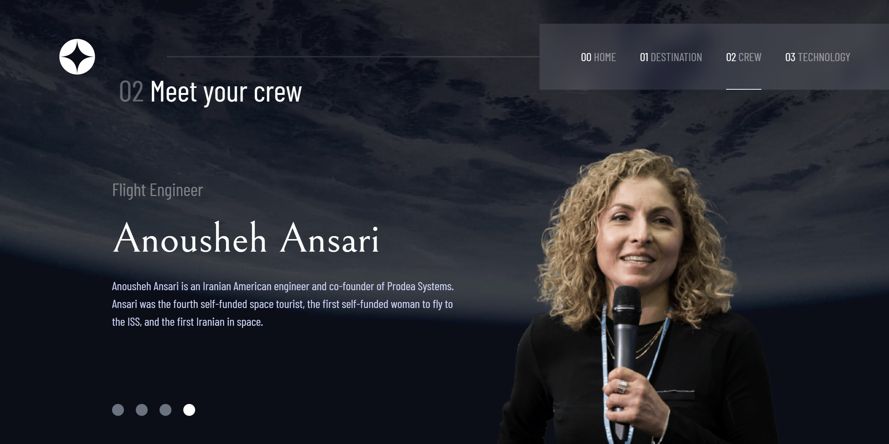
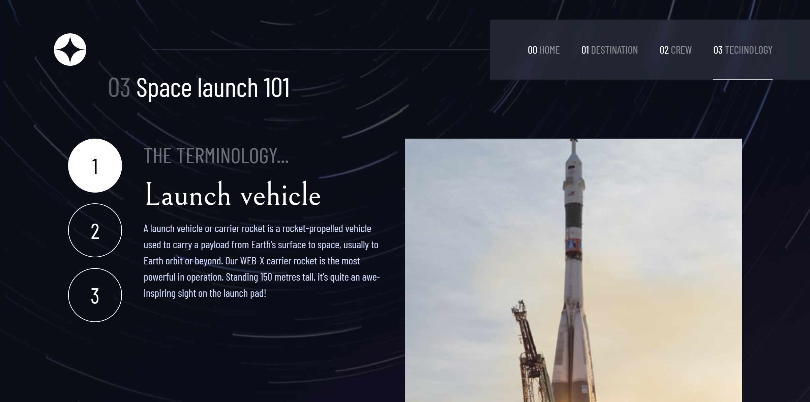

# Frontend Mentor - Space tourism website solution

This is a solution to the [Space tourism website challenge on Frontend Mentor](https://www.frontendmentor.io/challenges/space-tourism-multipage-website-gRWj1URZ3). Frontend Mentor challenges help you improve your coding skills by building realistic projects. 

## Table of contents

- [Overview](#overview)
  - [The challenge](#the-challenge)
  - [Screenshot](#screenshot)
  - [Links](#links)
- [My process](#my-process)
  - [Built with](#built-with)
  - [What I learned](#what-i-learned)
  - [Continued development](#continued-development)
  - [Useful resources](#useful-resources)
- [Author](#author)
- [Acknowledgments](#acknowledgments)


## Overview
The Space Tourism website gives us a littel wonder of **"OUTERSPACE"** in addition with crew.
Built with Reactjs for state and component management, React-Router for routing through each page and Tailwind framework for styling.
### The challenge

Users should be able to:

- View the optimal layout for each of the website's pages depending on their device's screen size
- See hover states for all interactive elements on the page
- View each page and be able to toggle between the tabs to see new information

### Screenshot

HOME

DESTINATION

CREW

TECHNOLOGY



### Links

- Solution URL: [Add solution URL here](https://your-solution-url.com)
- Live Site URL: [space tourism](https://space-tourism-website-eta-six.vercel.app/)

## My process

### Built with

- Semantic HTML5 markup
- Reactjs React-router
- CSS custom properties
- Flexbox
- [Tailwind](https://tailwindcss.com/docs/) - For styles
- Mobile-first workflow
- [React](https://reactjs.org/) - JS library


### What I learned

***So css syling isn't easy honestly whoever said that can be lying. you always really need to know what property and value that needed in making the style effective.***

**Story**

My Navigation components always seem to not follow what I want on postion(css property) It was out of the **Home, Crew, Destination, Technology** components so basically the background-image property doesn't seem to work. So I used position great it worked! but guess what only for(Tablet and Desktop) it couldn't allow me to handle the hamburger-menu then I said ok why don't I remove the postion property on small screen so the hamburger-menu can flow but when I did that the header which was what is handling the postion property flow outside the background-img. Then I said why not put the Navigation component on each component **(Home, Crew, Destination, Technology)** container from where the background-img is applied and set a min-width media query from 768px postion fixed that way the navigation component doesn't flow outside each component and it worked!!!😁 Now my hamburger-menu can flow relative to the #root element and not the header.

code snippets, see below:

```html
<!-- Home Element -->
<main className='homeBgImg '>
  <Navigation />
  <p>Home</p>
</main>
<!-- Destination Element -->
<div className='destinationBgImg'>
  <Navigation />
  <p>Destination!</p>
</div>
<!-- Crew Element -->
<div className='crewBgImg'>
  <Navigation />
  <p>Crew!</p>
</div>
<!-- Technology Element -->
<div className='technologyBgImg'>
  <Navigation />
  <p>Technology!</p>
</div>
```
```css
@media (min-width: 768px) {
  header {
    position: fixed;
  }
}
```

### Continued development

Get the right path to what file your looking for seems simple but even the slightest bit of error on your path can lead to confusion you don't want. I suggest arranging them or you go along as you build.

***Mistake can happen but don't let it get to you saying you should have mastered this by now***


### Useful resources

- [w3schools](https://www.w3schools.com/react/react_router.asp) - Used for brushing up knowledge on react-router
- [Stack Overflow](https://stackoverflow.com/questions/51346824/css-rotation-without-pausing) - Helped me simple css animation without pause.

## Author

- Website - [maduanusi.vercel.app](https://maduanusi.vercel.app)
- Frontend Mentor - [@therealmaduanusi](https://www.frontendmentor.io/profile/therealmaduanusi)
- Twitter - [@madu_anusi](https://www.twitter.com/madu_anusi)


## Acknowledgments

FMC for creating such challenge and me for taking it on
